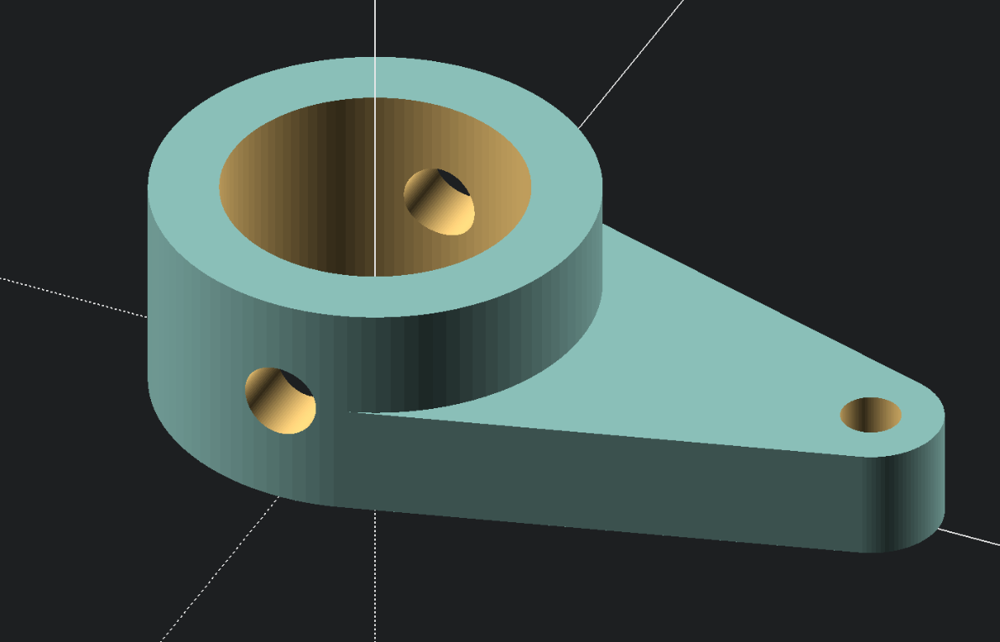

A collection of CAD files pertaining to the Flexicoil 50 series and older air cart meter rollers.  An OpenSCAD library, called "Flexicoil Meter Segment.scad" creates various kinds of meter roller segments, for 3-D printing.  Currently implemented roller types are extra fine (canola), fine (wheat), coarse (fertlizer, peas), extra coarse (large peas etc), and blank, with a 1 1/8" hex hole through them.  Dimensions defining the diameter and width of the rollers, as well as printer tolerances for the hex hole, are in dimensions.scad.

dimensions.scad defines common dimensions used by all the meter roller segment types and Flexicoil Meter Segment.scad contains parametric segment creator modules.

`Extra Fine Segments.scad`, `Fine Segments.scad`, `Coarse Segments.scad`, and `Extra Coarse Segments.scad` demonstrate all of the variants of the different segment types possible.  In order to create an STL of a specific variant, comment out the other module calls in the scad file before exporting to STL.

Most objects can be printed without supports.  The bearing endcap can be printed as it renders (with the open cup up) with supports in TPU 95A, with between 25 and 50% infill.  Supports, even when made with TPU, seem to remove pretty well.  

Meter segments seem to print quite well with TPU 95A, with 5 walls and 30% infill.  The mechanical properties end up being very similar to the OEM parts.

Spacers and Bushings can be printed out of either ABS or PETG.  You will likely have to adjust the tolerances to get a good fit on the shaft and bearings.

