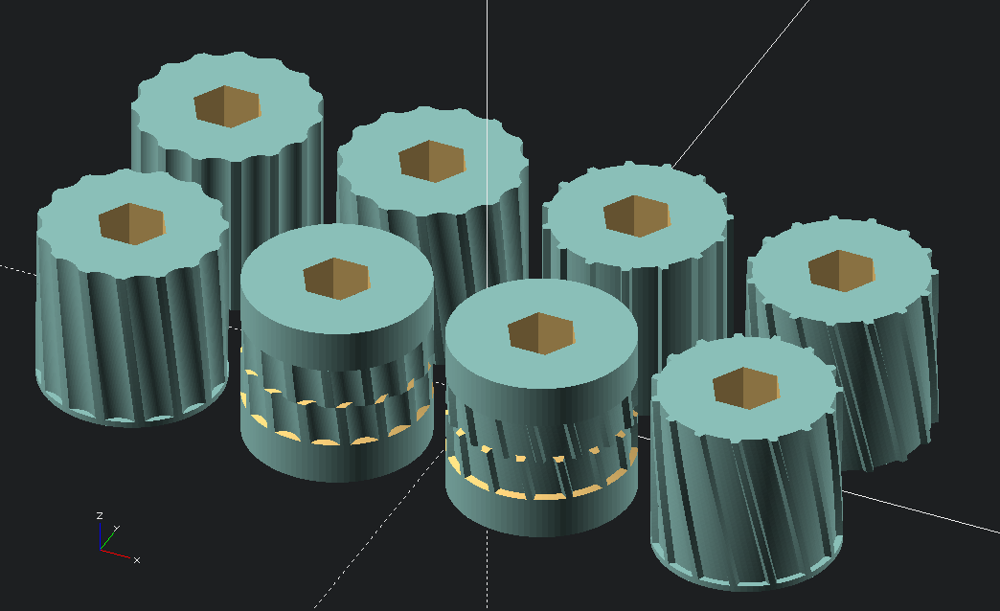
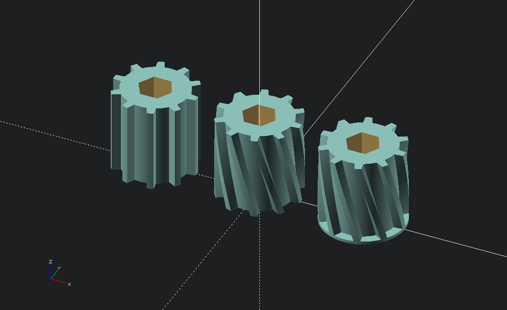
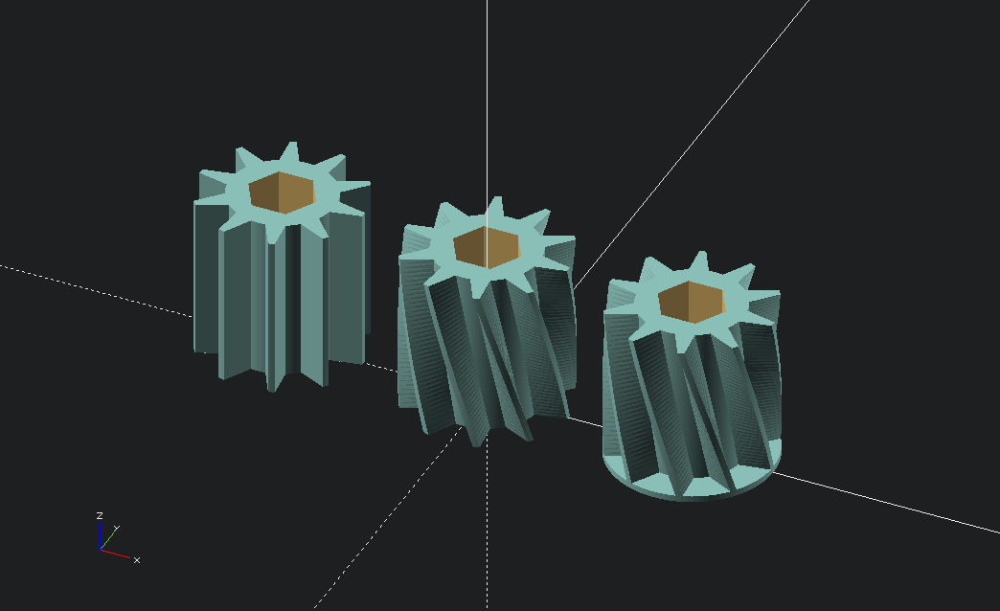
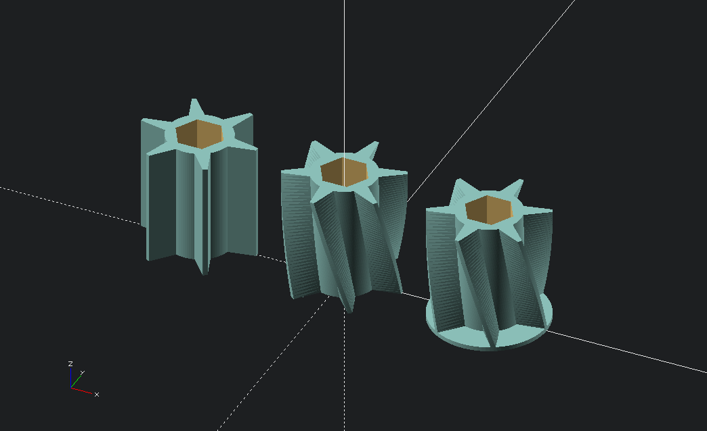

A collection of CAD files pertaining to the Flexicoil 50 series and older air cart meter rollers.  An OpenSCAD library, called "Flexicoil Meter Segment.scad" creates various kinds of meter roller segments, for 3-D printing.  Currently implemented roller types are extra fine (canola), fine (wheat), coarse (fertlizer, peas), extra coarse (large peas etc), and blank, with a 1 1/8" hex hole through them.  Dimensions defining the diameter and width of the rollers, as well as printer tolerances for the hex hole, are in dimensions.scad.

dimensions.scad defines common dimensions used by all the meter roller segment types and Flexicoil Meter Segment.scad contains parametric segment creator modules.

`Extra Fine Segments.scad`, `Fine Segments.scad`, `Coarse Segments.scad`, and `Extra Coarse Segments.scad` demonstrate all of the variants of the different segment types possible.  In order to create an STL of a specific variant, comment out the other module calls in the scad file before exporting to STL.

